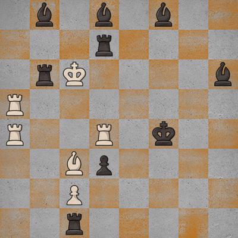

# ♟️ FENGEN

An attempt at implementing a multi-class classification neural network for generating FEN strings.

## Structure

| Codebase         |      Description       |
| :--------------- | :--------------------: |
| [shrimp](shrimp) | Train and export model |
| [pho](pho)       |       Web server       |

## Credits

- Pavel Koryakin for the dataset https://www.kaggle.com/koryakinp/chess-positions
